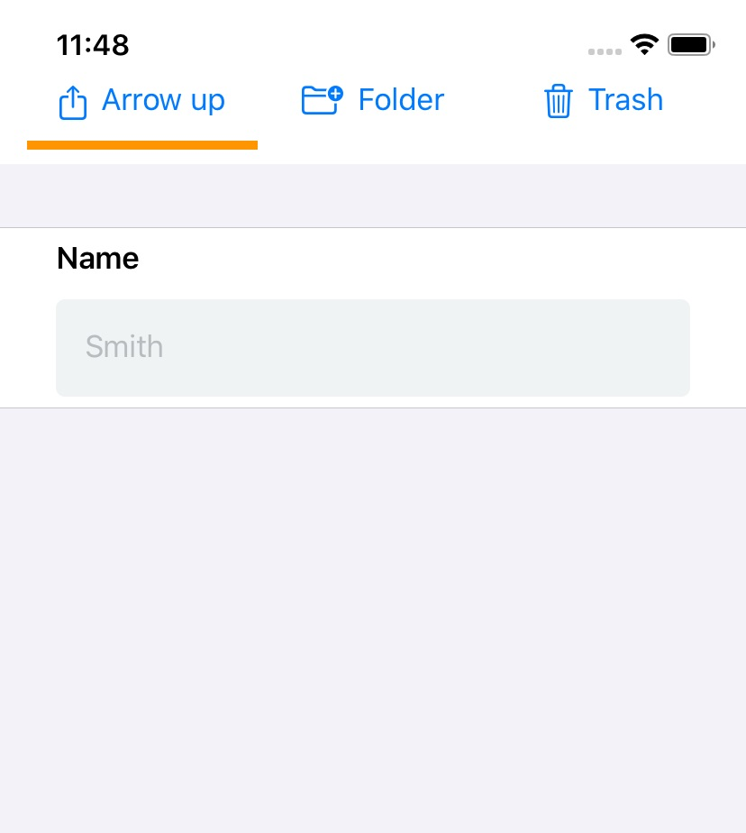

# TopTabView

A SwiftUI TopTabView component which shows Tab on top.



# Installation

Install through Swift Package Manager.

# Example

## Example 1:

```
import TopTabView

struct ContentView: View {
  @State var selectedSegment = 0
    
  var body: some View {
    return TopTabView(items: [
      TopTabView.Item(title: "Arrow up", icon: Image(systemName:"square.and.arrow.up")),
      TopTabView.Item(title: "Folder", icon: Image(systemName:"folder.badge.plus")),
      TopTabView.Item(title: "Trash", icon: Image(systemName:"trash"))
      ], selection: $selectedSegment, onSelected:  {
        index in
        self.selectedSegment = index
    }) {
      if self.selectedSegment == 0 {
        VStack {
          Text("Tab 1")
        }
      } else if self.selectedSegment == 1 {
        VStack {
          Text("Tab 2")
        }
      } else {
        VStack {
          Text("Tab 3")
        }
      }
    }
  }
}
```

# TODO:

1. Make it similar with TabView


